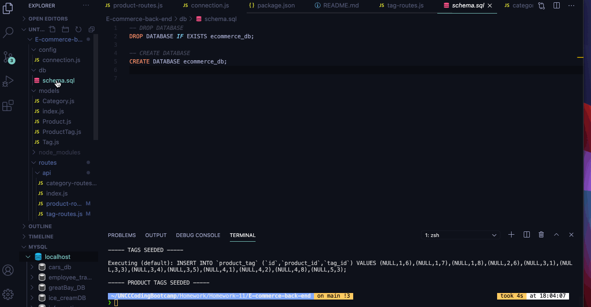
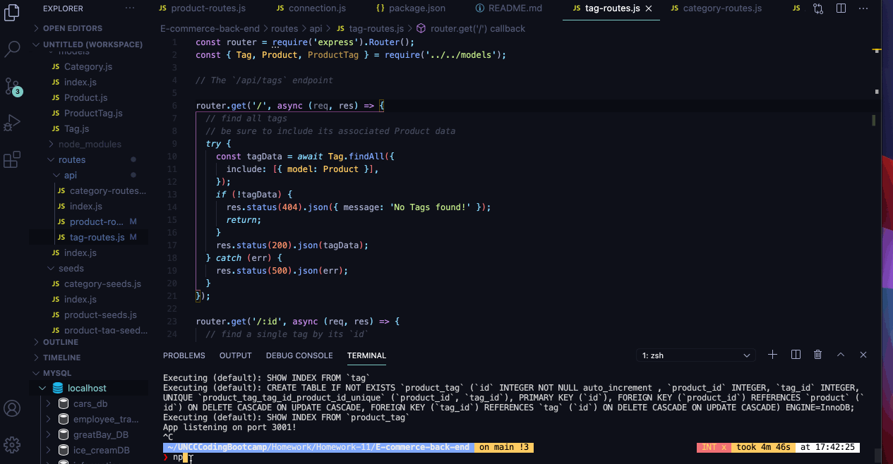
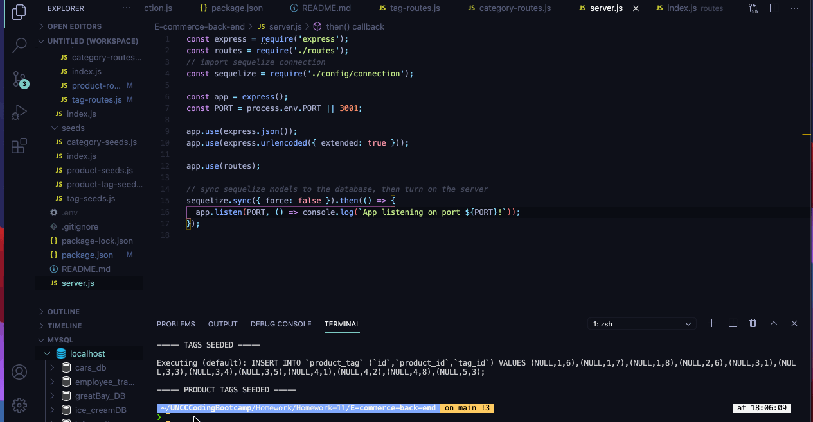
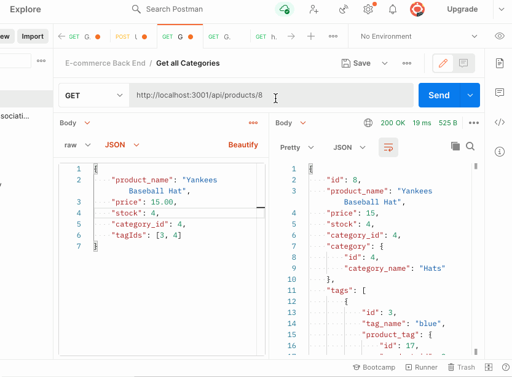
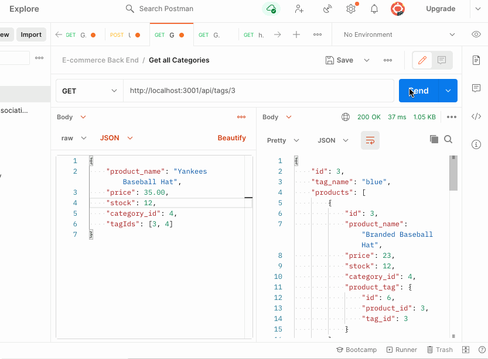
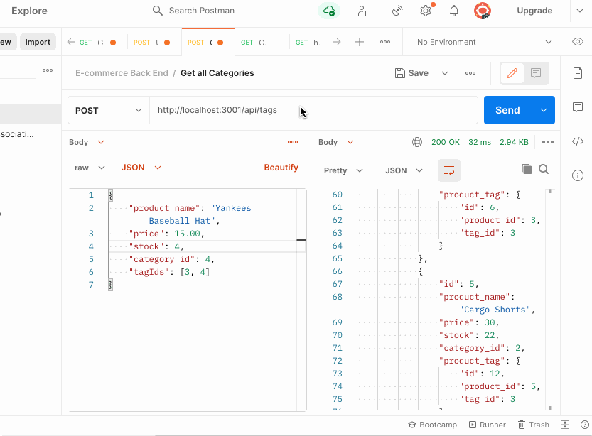
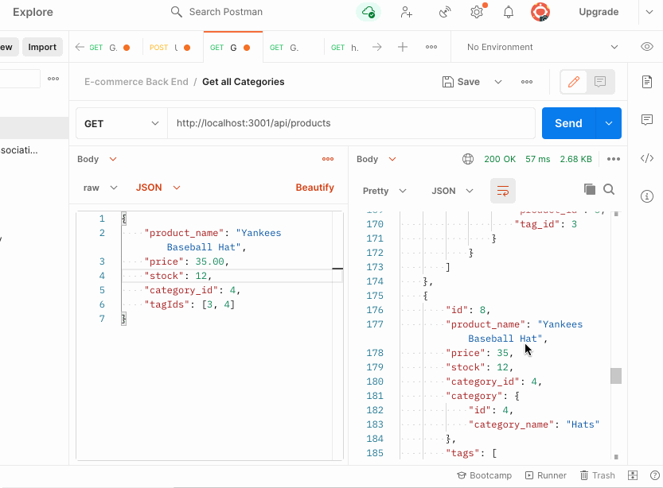

# E-commerce-back-end
The back end for an E-commerce site, built using Express.js API, sequelize and MySQL as a database

## Table of Contents

* [JS](#JS)
* [Requirements](#Requirements)
* [Installation](#Installation)
* [Contributing](#Contributing)

## JS
Wrote the back end for the E-commerce website using Node.js, Express, sequelize and mySQL. 

How to create schema from mySQL: 

How to seed from CLI: 

How to start app server: 

How to GET routes for categories, products and Tags: 

Get Routes for single product, tag or category: 

How to do a POST (create) for a product: 

How to do a PUT (update) for a product: 

How to do a DELETE (delete) for a product: 

## Requirements

GIVEN a functional Express.js API
WHEN I add my database name, MySQL username, and MySQL password to an environment variable file
THEN I am able to connect to a database using Sequelize
WHEN I enter schema and seed commands
THEN a development database is created and is seeded with test data
WHEN I enter the command to invoke the application
THEN my server is started and the Sequelize models are synced to the MySQL database
WHEN I open API GET routes in Insomnia Core for categories, products, or tags
THEN the data for each of these routes is displayed in a formatted JSON
WHEN I test API POST, PUT, and DELETE routes in Insomnia Core
THEN I am able to successfully create, update, and delete data in my database

## Installation

There is no need to install anything, to view the E-commerce back end simply follow the link below. 

See deployed site here: [Deployed site](https://e-commerce-back-end-jj.herokuapp.com/api/categories) 

See repository here: [GitHub Repo](https://github.com/JD-Jaramillo/E-commerce-back-end)

## Contributing

If you have any tips or ideas on how to improve the E-commerce back end please reach out to me directly. 

Email: Jaramillo784@gmail.com
